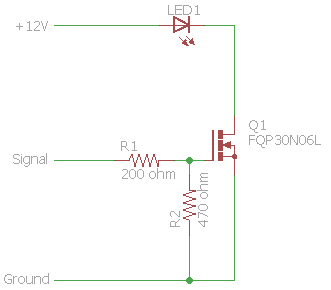

# TheaterLightingAutomation
Controls theater lighting through [Kodi](http://www.kodi.tv) connected to an [Arduino](http://www.arduino.cc).

## Arduino Portion (LightFader)
This code is uploaded to an Arduino to PWM dim one or more lights. The intent is that the functionality is flexible enough to handle a number of circumstances.
Channels are numbered from `0` to `NUM_CHANNELS` and can be assigned to any PWM-capable pin.
The protocol is designed to be used between the Arduino and a software program, but everything is human-readable and connecting to the serial port with a terminal program will allow one to send commands and query status. Type `help\n` in the terminal to see a list of commands. Baud rate is 57600, 8 data bits, no parity bit, 1 stop bit.

### Changing pins and channels
To modify the number of channels and which pin each channel points to, ensure that:
* `NUM_CHANNELS` is correct
* `channels[]`, `values[]`, `fadeModes[]`, `startTimes[]`, `durations[]`, `aValues[]`, and `bValues[]` have the right number of elements as dictated by `NUM_CHANNELS`
* each `channel[]` element points to a valid PWM pin

### Hardware
The hardware configuration for physically connecting to lighting can be simple or complicated. For testing, a simple resistor and LED work well. For LED strips or most other LED lighting a moderate transistor (e.g. Darlington, MOSFET) must be used. For other lighting such as incandescents more complicated circuits with triacs and diacs need to be assembled.
In my setup I use [FQP30N06L N-channel MOSFETs](http://www.mouser.com/Search/ProductDetail.aspx?R=FQP30N06LvirtualkeyFQP30N06Lvirtualkey512-FQP30N06L) to allow me to use the 5-volt PWM signal to dim a 12-volt power source. These transistors are good for 32 amps and 79 watts, so each one should be able to dim a LOT of LEDs!
Here is an example circuit for a single channel:

More info about using MOSFETs as switches can be found [here](http://www.electronics-tutorials.ws/transistor/tran_7.html).

## Kodi Add-on (script.service.ke4ukz.theaterlightingautomation)
This service allows for control of lights (and possibly other devices) by sending commands over a serial port when playback events occur.
Almost all parameters are user-configurable, from whether or not to even fade to the fade duration and lighting levels. Currently two lighting channels can be controlled (house and aisle), but this may be expanded to three to include an ambient/mood lighting channel.
While designed to work on a Raspberry Pi running raspbmc or OSMC, there shouldn't be any reason it won't work on other systems as well.

### Configurable Settings (in Kodi)
* Serial port and speed
* Dim on pause
* Dim on screensaver
* Fade duration
* Independent selection for controlling house and aisle lighting
* Light channel for each house and aisle
* Normal lighting level for house and aisle
* Playing lighting level for house and aisle
* Paused lighting level for house and aisle
* Screensaver lighting level for house and aisle
