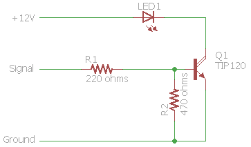

# TheaterLightingAutomation
Controls theater lighting through [Kodi](http://www.kodi.tv) connected to an [Arduino](http://www.arduino.cc).

## Arduino Portion (LightFader)
This code is uploaded to an Arduino to PWM dim one or more lights. The intent is that the functionality is flexible enough to handle a number of circumstances.
Channels are numbered from `0` to `NUM_CHANNELS` and can be assigned to any PWM-capable pin.
The protocol is designed to be used between the Arduino and a software program, but everything is human-readable and connecting to the serial port with a terminal program will allow one to send commands and query status. Type `help\n` in the terminal to see a list of commands. Baud rate is 57600, 8 data bits, no parity bit, 1 stop bit.

### Changing pins and channels
To modify the number of channels and which pin each channel points to, ensure that:
* `NUM_CHANNELS` is correct
* each `channel[]` element points to a valid PWM pin

The arrays for `channels[]`, `values[]`, `fadeModes[]`, `startTimes[]`, `durations[]`, `aValues[]`, and `bValues[]` are automatically zero-initialized and have elements as dictated by `NUM_CHANNELS`

### Hardware
The hardware configuration for physically connecting to lighting can be simple or complicated. For testing, a simple resistor and LED work well. For LED strips or most other LED lighting a moderate transistor (e.g. Darlington, MOSFET) must be used. For other lighting such as incandescents more complicated circuits with triacs and diacs need to be assembled.
In my setup I use two [FQP30N06L N-channel MOSFETs](http://www.mouser.com/Search/ProductDetail.aspx?R=FQP30N06LvirtualkeyFQP30N06Lvirtualkey512-FQP30N06L) and one [TIP120 NPN Darlington array](http://www.mouser.com/ProductDetail/STMicroelectronics/TIP120/?qs=ljbEvF4DwOPl3O93r6IAPg%3D%3D) to allow me to use the 5-volt PWM signal to dim a 12-volt power source. The MOSFETs are good for 32 amps and 79 watts, and the Darlington is 5 amps and 65 watts, so each one should be able to dim a LOT of LEDs!
Here are a couple example circuits for a single channel:

More info about using MOSFETs as switches can be found [here](http://www.electronics-tutorials.ws/transistor/tran_7.html). Remember that if you're using an inductive load instead of LEDs (like, say, controlling a cooling fan) you'll need to put a flyback diode in parallel with it.

## Kodi Add-on (script.service.ke4ukz.theaterlightingautomation)
This service allows for control of lights (and possibly other devices) by sending commands over a serial port when playback events occur.
Almost all parameters are user-configurable, from whether or not to even fade to the fade duration and lighting levels. Currently three lighting channels can be controlled: house, aisle, and ambient.
While designed to work on a Raspberry Pi running raspbmc or OSMC, there shouldn't be any reason it won't work on other systems as well (I do my testing on Kodi 14.2 on Windows 7).

### Configurable Settings (in Kodi)
* Serial port and speed
* Dim on pause
* Dim on screensaver
* Fade duration
* Independent selection for controlling house, aisle, and ambient lighting
* Light channel for each house, aisle, and ambient
* Normal lighting level for house, aisle, and ambient
* Playing lighting level for house, aisle, and ambient
* Paused lighting level for house, aisle, and ambient
* Screensaver lighting level for house, aisle, and ambient
